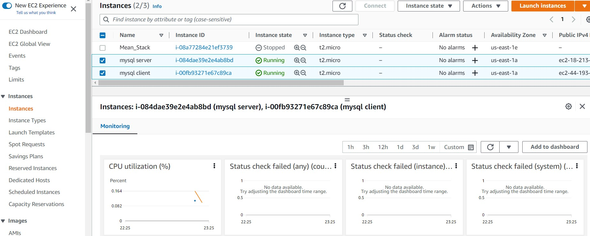

## TASK – Implementing a Client Server Architecture using MySQL Database Management System (DBMS).  

The instructions below highlights a step by step approach to setting up a a basic client-server using MySQL Relational Database Management System (RDBMS).  

### Step 1  
I created and configured two Linux-based virtual servers (EC2 instances in AWS).    
Server A name - `mysql server`  
Server B name - `mysql client` P 172-31-8-53 
               

Connected to mysql server and update  `sudo apt update`    
                
Then installed mysql server - `sudo apt install mysql-server -y`      
          

Enabled mysql - `sudo systemctl enable mysql    
              

Then connected the client: as instance to install mysql client software     
Firstly apply same commands as above to ensure that update had been done and then install mysql-client - `sudo apt install mysql-client`        
                  

By default, both of my EC2 virtual servers are located in the same local virtual network, so they can communicate to each other using local IP addresses.   
MySQL server uses TCP port 3306 by default, so had to create it as a new entry in ‘Inbound rules’ in ‘mysql server’ Security Groups.    
 For extra security, I did not allow all IP addresses to reach my ‘mysql server’ – I allowed access only to the specific local IP address of my‘mysql client’   
             

Then run the security script to secure mysql on the server and follow all the prompts- `sudo mysql_secure_installation`       

          

Then sudo into my sql instance using the `sudo mysql` command and it will assume I am root and hence no password requested. 

Create a user 'remote_user, create a table 'test_db' and grant privileges to table.             
                

To configure MySQL server to allow connections from remote hosts.       
`sudo vi /etc/mysql/mysql.conf.d/mysqld.cnf` and replace  ‘127.0.0.1’ to ‘0.0.0.0’ like this:           
               

Testing a remote connection from mysql client:          
             

To check that you have successfully connected to a remote MySQL server and can perform SQL queries: run the command `Show databases;`           

             

The image above indicates a successful connection and that you can see the database tables from a remote connection from the client server.

